# 🧠 DocuBrain: Enterprise RAG API

Welcome to **DocuBrain**, a modular, asynchronous, and production-ready Retrieval-Augmented Generation (RAG) API built with FastAPI, PostgreSQL, Qdrant, and Google Gemini. 

DocuBrain ingests large PDF documents, securely chunks them, generates semantic embeddings, and exposes an intelligent `/query` endpoint that answers user questions based strictly on the ingested context, complete with exact page citations.

---

## 🏗 Architecture

The system is designed with a modern microservice-style architecture separated into core logical components:

```mermaid
sequenceDiagram
    participant Client
    participant FastAPI as DocuBrain API
    participant PostgreSQL as Postgres (Metadata)
    participant Qdrant as Qdrant (Vector DB)
    participant Gemini as Google Gemini API
    
    %% Ingestion Flow
    rect rgb(30, 30, 30)
    Note over Client,Gemini: Document Ingestion Flow
    Client->>FastAPI: POST /api/v1/upload (PDF)
    FastAPI->>PostgreSQL: Create PENDING document
    FastAPI-->>Client: 202 Accepted (doc_id)
    FastAPI-)FastAPI: Background Task: Parse & Chunk PDF
    FastAPI->>Gemini: aembed_documents(chunks)
    Gemini-->>FastAPI: Vector Embeddings (768d)
    FastAPI->>Qdrant: Upsert vectors & metadata
    FastAPI->>PostgreSQL: Update status to COMPLETED
    end
    
    %% Retrieval Flow
    rect rgb(30, 30, 30)
    Note over Client,Gemini: Retrieval Flow (RAG)
    Client->>FastAPI: POST /api/v1/query {question}
    FastAPI->>Gemini: aembed_query(question)
    Gemini-->>FastAPI: Query Vector
    FastAPI->>Qdrant: search(query_vector, limit=4)
    Qdrant-->>FastAPI: Top chunks + Page Numbers
    FastAPI->>Gemini: ChatPrompt(context + question)
    Gemini-->>FastAPI: Generated Answer with Citations
    FastAPI-->>Client: 200 OK (Answer + Sources array)
    end
```



## 🛠 Tech Stack
- **Framework**: `FastAPI` (Python 3.10+)
- **Database (SQL)**: `PostgreSQL` + `SQLAlchemy` (Async) + `Alembic`
- **Database (Vector)**: `Qdrant` (Cosine distance, 768d)
- **AI / Embeddings**: `Google Gemini` (`gemini-1.5-flash` / `text-embedding-004`)
- **Parsing**: `PyMuPDF` (`fitz`)
- **Orchestration**: `LangChain`

## 🚀 Getting Started

### 1. Prerequisites
- Python 3.9+
- A running PostgreSQL instance.
- A remote Qdrant Cloud cluster.
- A Google Gemini API Key.

### 2. Installation
Clone the repository and set up a virtual environment:
```bash
git clone https://github.com/ruvaid19/DocuBrain.git
cd DocuBrain
python3 -m venv .venv
source .venv/bin/activate
pip install -r requirements.txt
```

### 3. Environment Variables
Create a `.env` file in the root directory:
```env
# Database
DATABASE_URL=postgresql+asyncpg://<USER>:<PASS>@localhost:5432/docubrain

# Qdrant Vector Store
QDRANT_URL=https://your-cluster-url.qdrant.tech
QDRANT_API_KEY=your_qdrant_api_key

# Google Gemini
GEMINI_API_KEY=your_google_ai_studio_key
```

### 4. Database Migrations
Run Alembic to create the metadata tables:
```bash
alembic upgrade head
```

### 5. Start the Server
```bash
uvicorn app.main:app --reload
```
Navigate to **`http://localhost:8000/docs`** to view the interactive Swagger UI!

---

## 🧪 Testing
This project includes an automated test suite written with `pytest`. It uses a custom mock for the Qdrant connection to allow isolated API endpoint testing.
```bash
pytest tests/
```
